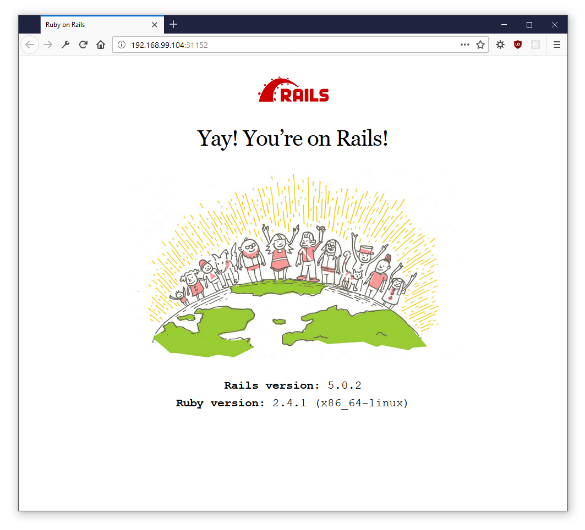

## Running

```shell
# minikube: v0.24.0
# cluster: v1.8
$ ./run.sh
```

The script will create the required kubernetes objects under the "hello-rails" namespace. It will also output the external ip/port at which the app will be served once the pods are created.

```shell
namespace "hello-rails" created
secret "mysql-pass" created
service "mysql-service" created
persistentvolumeclaim "mysql-volume-claim" created
deployment "mysql-deployment" created
service "rails-service" created
deployment "rails-deployment" created

http://192.168.99.104:31152
```

## Production Engineering / Infrastructure Problem

- Install minikube on your computer.
- Get this simple [rails on docker](https://hub.docker.com/r/benjamincaldwell/hello-docker-rails/) application running inside Kubernetes.

###### Hint: This will typically involve creating two separate deployments: one for the web application and another for MySQL. Creating a Kubernetes namespace for your application will help keep things organized.

### What to submit

Send us a screenshot of the working application, and the output of running the following command:

```
kubectl describe deployments -n <your-app-namespace>
```

---



```shell
$ kubectl describe deployments -n hello-rails
Name:               mysql-deployment
Namespace:          hello-rails
CreationTimestamp:  Sat, 27 Jan 2018 18:42:09 -0500
Labels:             app=mysql-app
Annotations:        deployment.kubernetes.io/revision=1
Selector:           app=mysql-app
Replicas:           1 desired | 1 updated | 1 total | 1 available | 0 unavailable
StrategyType:       Recreate
MinReadySeconds:    0
Pod Template:
  Labels:  app=mysql-app
  Containers:
   mysql:
    Image:  mysql:8.0.3
    Port:   3306/TCP
    Environment:
      MYSQL_ROOT_PASSWORD:  <set to the key 'password' in secret 'mysql-pass'>  Optional: false
    Mounts:
      /var/lib/mysql from mysql-volume (rw)
  Volumes:
   mysql-volume:
    Type:       PersistentVolumeClaim (a reference to a PersistentVolumeClaim in the same namespace)
    ClaimName:  mysql-volume-claim
    ReadOnly:   false
Conditions:
  Type           Status  Reason
  ----           ------  ------
  Available      True    MinimumReplicasAvailable
  Progressing    True    NewReplicaSetAvailable
OldReplicaSets:  <none>
NewReplicaSet:   mysql-deployment-65f8446966 (1/1 replicas created)
Events:
  Type    Reason             Age   From                   Message
  ----    ------             ----  ----                   -------
  Normal  ScalingReplicaSet  19m   deployment-controller  Scaled up replica set mysql-deployment-65f8446966 to 1


Name:                   rails-deployment
Namespace:              hello-rails
CreationTimestamp:      Sat, 27 Jan 2018 18:42:09 -0500
Labels:                 app=rails-app
Annotations:            deployment.kubernetes.io/revision=1
Selector:               app=rails-app
Replicas:               3 desired | 3 updated | 3 total | 3 available | 0 unavailable
StrategyType:           RollingUpdate
MinReadySeconds:        0
RollingUpdateStrategy:  25% max unavailable, 25% max surge
Pod Template:
  Labels:  app=rails-app
  Containers:
   hello-docker-rails:
    Image:  benjamincaldwell/hello-docker-rails:v0.2
    Port:   3000/TCP
    Environment:
      MYSQL_USER:      root
      MYSQL_PASSWORD:  <set to the key 'password' in secret 'mysql-pass'>  Optional: false
      MYSQL_HOST:      mysql-service
      MYSQL_PORT:      3306
    Mounts:            <none>
  Volumes:             <none>
Conditions:
  Type           Status  Reason
  ----           ------  ------
  Progressing    True    NewReplicaSetAvailable
  Available      True    MinimumReplicasAvailable
OldReplicaSets:  <none>
NewReplicaSet:   rails-deployment-7cd89c8797 (3/3 replicas created)
Events:
  Type    Reason             Age   From                   Message
  ----    ------             ----  ----                   -------
  Normal  ScalingReplicaSet  19m   deployment-controller  Scaled up replica set rails-deployment-7cd89c8797 to 3
```

```shell
$ kubectl describe pods -n hello-rails
Name:           mysql-deployment-65f8446966-rws5z
Namespace:      hello-rails
Node:           minikube/192.168.99.104
Start Time:     Sat, 27 Jan 2018 18:42:10 -0500
Labels:         app=mysql-app
                pod-template-hash=2194002522
Annotations:    kubernetes.io/created-by={"kind":"SerializedReference","apiVersion":"v1","reference":{"kind":"ReplicaSet","namespace":"hello-rails","name":"mysql-deployment-65f8446966","uid":"b0b5a0f5-03bb-11e8-9404-...
Status:         Running
IP:             172.17.0.10
Controlled By:  ReplicaSet/mysql-deployment-65f8446966
Containers:
  mysql:
    Container ID:   docker://9352f07727ea185419b0aa1e895351642d0b9c3c50fac434b9088bf78c648b43
    Image:          mysql:8.0.3
    Image ID:       docker-pullable://mysql@sha256:21cc59a132e029c688734a66b50bfa7e5b31af9f2f19267f463c247d51c67b5a
    Port:           3306/TCP
    State:          Running
      Started:      Sat, 27 Jan 2018 18:42:11 -0500
    Ready:          True
    Restart Count:  0
    Environment:
      MYSQL_ROOT_PASSWORD:  <set to the key 'password' in secret 'mysql-pass'>  Optional: false
    Mounts:
      /var/lib/mysql from mysql-volume (rw)
      /var/run/secrets/kubernetes.io/serviceaccount from default-token-rcdbt (ro)
Conditions:
  Type           Status
  Initialized    True
  Ready          True
  PodScheduled   True
Volumes:
  mysql-volume:
    Type:       PersistentVolumeClaim (a reference to a PersistentVolumeClaim in the same namespace)
    ClaimName:  mysql-volume-claim
    ReadOnly:   false
  default-token-rcdbt:
    Type:        Secret (a volume populated by a Secret)
    SecretName:  default-token-rcdbt
    Optional:    false
QoS Class:       BestEffort
Node-Selectors:  <none>
Tolerations:     <none>
Events:
  Type     Reason                 Age                From               Message
  ----     ------                 ----               ----               -------
  Warning  FailedScheduling       20m (x2 over 20m)  default-scheduler  PersistentVolumeClaim is not bound: "mysql-volume-claim"
  Normal   Scheduled              20m                default-scheduler  Successfully assigned mysql-deployment-65f8446966-rws5z to minikube
  Normal   SuccessfulMountVolume  20m                kubelet, minikube  MountVolume.SetUp succeeded for volume "pvc-b0b11c5e-03bb-11e8-9404-080027c344ed"
  Normal   SuccessfulMountVolume  20m                kubelet, minikube  MountVolume.SetUp succeeded for volume "default-token-rcdbt"
  Normal   Pulled                 20m                kubelet, minikube  Container image "mysql:8.0.3" already present on machine
  Normal   Created                20m                kubelet, minikube  Created container
  Normal   Started                20m                kubelet, minikube  Started container


Name:           rails-deployment-7cd89c8797-dk9gl
Namespace:      hello-rails
Node:           minikube/192.168.99.104
Start Time:     Sat, 27 Jan 2018 18:42:09 -0500
Labels:         app=rails-app
                pod-template-hash=3784574353
Annotations:    kubernetes.io/created-by={"kind":"SerializedReference","apiVersion":"v1","reference":{"kind":"ReplicaSet","namespace":"hello-rails","name":"rails-deployment-7cd89c8797","uid":"b0f29d8e-03bb-11e8-9404-...
Status:         Running
IP:             172.17.0.6
Controlled By:  ReplicaSet/rails-deployment-7cd89c8797
Containers:
  hello-docker-rails:
    Container ID:   docker://d395cc1bce6e4e745ee8264d6381a54795ab1d766a2d2d6560169740d16b6629
    Image:          benjamincaldwell/hello-docker-rails:v0.2
    Image ID:       docker-pullable://benjamincaldwell/hello-docker-rails@sha256:c1203338222ee6c7f655d87916477c822d57ef31c4908afe999d9529085f1374
    Port:           3000/TCP
    State:          Running
      Started:      Sat, 27 Jan 2018 18:42:49 -0500
    Last State:     Terminated
      Reason:       Error
      Exit Code:    1
      Started:      Sat, 27 Jan 2018 18:42:23 -0500
      Finished:     Sat, 27 Jan 2018 18:42:34 -0500
    Ready:          True
    Restart Count:  2
    Environment:
      MYSQL_USER:      root
      MYSQL_PASSWORD:  <set to the key 'password' in secret 'mysql-pass'>  Optional: false
      MYSQL_HOST:      mysql-service
      MYSQL_PORT:      3306
    Mounts:
      /var/run/secrets/kubernetes.io/serviceaccount from default-token-rcdbt (ro)
Conditions:
  Type           Status
  Initialized    True
  Ready          True
  PodScheduled   True
Volumes:
  default-token-rcdbt:
    Type:        Secret (a volume populated by a Secret)
    SecretName:  default-token-rcdbt
    Optional:    false
QoS Class:       BestEffort
Node-Selectors:  <none>
Tolerations:     <none>
Events:
  Type     Reason                 Age                From               Message
  ----     ------                 ----               ----               -------
  Normal   Scheduled              20m                default-scheduler  Successfully assigned rails-deployment-7cd89c8797-dk9gl to minikube
  Normal   SuccessfulMountVolume  20m                kubelet, minikube  MountVolume.SetUp succeeded for volume "default-token-rcdbt"
  Warning  BackOff                20m                kubelet, minikube  Back-off restarting failed container
  Warning  FailedSync             20m                kubelet, minikube  Error syncing pod
  Normal   Pulled                 19m (x3 over 20m)  kubelet, minikube  Container image "benjamincaldwell/hello-docker-rails:v0.2" already present on machine
  Normal   Created                19m (x3 over 20m)  kubelet, minikube  Created container
  Normal   Started                19m (x3 over 20m)  kubelet, minikube  Started container


Name:           rails-deployment-7cd89c8797-jqrkt
Namespace:      hello-rails
Node:           minikube/192.168.99.104
Start Time:     Sat, 27 Jan 2018 18:42:09 -0500
Labels:         app=rails-app
                pod-template-hash=3784574353
Annotations:    kubernetes.io/created-by={"kind":"SerializedReference","apiVersion":"v1","reference":{"kind":"ReplicaSet","namespace":"hello-rails","name":"rails-deployment-7cd89c8797","uid":"b0f29d8e-03bb-11e8-9404-...
Status:         Running
IP:             172.17.0.5
Controlled By:  ReplicaSet/rails-deployment-7cd89c8797
Containers:
  hello-docker-rails:
    Container ID:   docker://3df1c4690c68da046584d949e1ff4a5574d10827eeb5b345092b1d050934cb68
    Image:          benjamincaldwell/hello-docker-rails:v0.2
    Image ID:       docker-pullable://benjamincaldwell/hello-docker-rails@sha256:c1203338222ee6c7f655d87916477c822d57ef31c4908afe999d9529085f1374
    Port:           3000/TCP
    State:          Running
      Started:      Sat, 27 Jan 2018 18:42:52 -0500
    Last State:     Terminated
      Reason:       Error
      Exit Code:    1
      Started:      Sat, 27 Jan 2018 18:42:24 -0500
      Finished:     Sat, 27 Jan 2018 18:42:35 -0500
    Ready:          True
    Restart Count:  2
    Environment:
      MYSQL_USER:      root
      MYSQL_PASSWORD:  <set to the key 'password' in secret 'mysql-pass'>  Optional: false
      MYSQL_HOST:      mysql-service
      MYSQL_PORT:      3306
    Mounts:
      /var/run/secrets/kubernetes.io/serviceaccount from default-token-rcdbt (ro)
Conditions:
  Type           Status
  Initialized    True
  Ready          True
  PodScheduled   True
Volumes:
  default-token-rcdbt:
    Type:        Secret (a volume populated by a Secret)
    SecretName:  default-token-rcdbt
    Optional:    false
QoS Class:       BestEffort
Node-Selectors:  <none>
Tolerations:     <none>
Events:
  Type     Reason                 Age                From               Message
  ----     ------                 ----               ----               -------
  Normal   Scheduled              20m                default-scheduler  Successfully assigned rails-deployment-7cd89c8797-jqrkt to minikube
  Normal   SuccessfulMountVolume  20m                kubelet, minikube  MountVolume.SetUp succeeded for volume "default-token-rcdbt"
  Warning  BackOff                20m                kubelet, minikube  Back-off restarting failed container
  Warning  FailedSync             20m                kubelet, minikube  Error syncing pod
  Normal   Pulled                 19m (x3 over 20m)  kubelet, minikube  Container image "benjamincaldwell/hello-docker-rails:v0.2" already present on machine
  Normal   Created                19m (x3 over 20m)  kubelet, minikube  Created container
  Normal   Started                19m (x3 over 20m)  kubelet, minikube  Started container


Name:           rails-deployment-7cd89c8797-wvhck
Namespace:      hello-rails
Node:           minikube/192.168.99.104
Start Time:     Sat, 27 Jan 2018 18:42:09 -0500
Labels:         app=rails-app
                pod-template-hash=3784574353
Annotations:    kubernetes.io/created-by={"kind":"SerializedReference","apiVersion":"v1","reference":{"kind":"ReplicaSet","namespace":"hello-rails","name":"rails-deployment-7cd89c8797","uid":"b0f29d8e-03bb-11e8-9404-...
Status:         Running
IP:             172.17.0.9
Controlled By:  ReplicaSet/rails-deployment-7cd89c8797
Containers:
  hello-docker-rails:
    Container ID:   docker://d862fbd21366f37d5de5b5d2259ba71c14ecec076720737f4c4450805ea9784a
    Image:          benjamincaldwell/hello-docker-rails:v0.2
    Image ID:       docker-pullable://benjamincaldwell/hello-docker-rails@sha256:c1203338222ee6c7f655d87916477c822d57ef31c4908afe999d9529085f1374
    Port:           3000/TCP
    State:          Running
      Started:      Sat, 27 Jan 2018 18:42:52 -0500
    Last State:     Terminated
      Reason:       Error
      Exit Code:    1
      Started:      Sat, 27 Jan 2018 18:42:24 -0500
      Finished:     Sat, 27 Jan 2018 18:42:35 -0500
    Ready:          True
    Restart Count:  2
    Environment:
      MYSQL_USER:      root
      MYSQL_PASSWORD:  <set to the key 'password' in secret 'mysql-pass'>  Optional: false
      MYSQL_HOST:      mysql-service
      MYSQL_PORT:      3306
    Mounts:
      /var/run/secrets/kubernetes.io/serviceaccount from default-token-rcdbt (ro)
Conditions:
  Type           Status
  Initialized    True
  Ready          True
  PodScheduled   True
Volumes:
  default-token-rcdbt:
    Type:        Secret (a volume populated by a Secret)
    SecretName:  default-token-rcdbt
    Optional:    false
QoS Class:       BestEffort
Node-Selectors:  <none>
Tolerations:     <none>
Events:
  Type     Reason                 Age                From               Message
  ----     ------                 ----               ----               -------
  Normal   Scheduled              20m                default-scheduler  Successfully assigned rails-deployment-7cd89c8797-wvhck to minikube
  Normal   SuccessfulMountVolume  20m                kubelet, minikube  MountVolume.SetUp succeeded for volume "default-token-rcdbt"
  Warning  BackOff                20m                kubelet, minikube  Back-off restarting failed container
  Warning  FailedSync             20m                kubelet, minikube  Error syncing pod
  Normal   Pulled                 19m (x3 over 20m)  kubelet, minikube  Container image "benjamincaldwell/hello-docker-rails:v0.2" already present on machine
  Normal   Created                19m (x3 over 20m)  kubelet, minikube  Created container
  Normal   Started                19m (x3 over 20m)  kubelet, minikube  Started container
```
